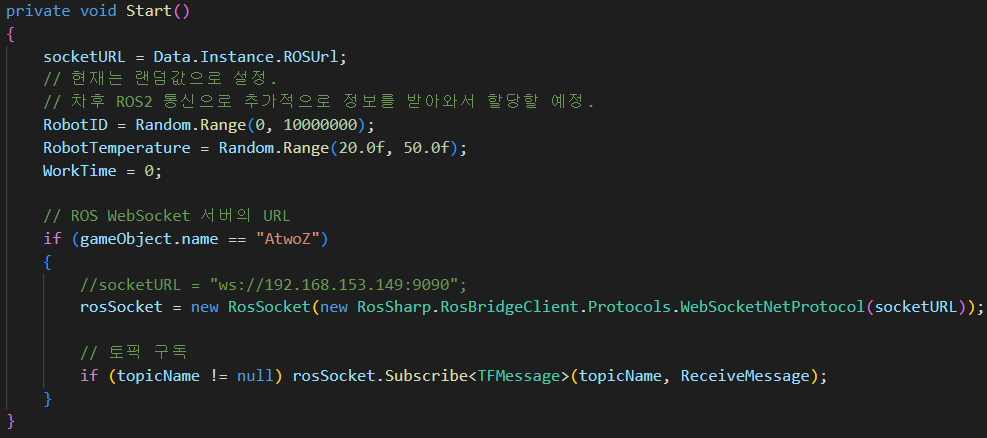
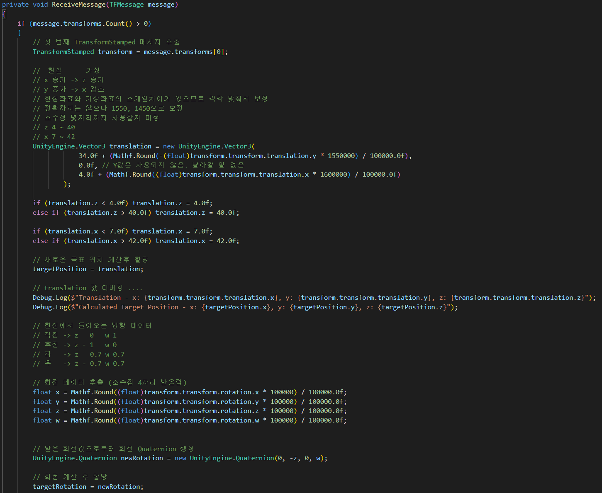
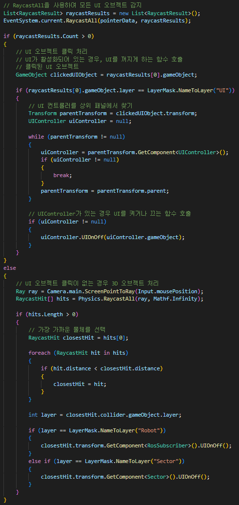

# 삼성 청년 SW 아카데미 공통 프로젝트 AtwoZ팀 - 류(流) : Digital Twin

 

## 류의 디지털 트윈과 관련된 내용을 담고 있는 문서입니다.

 

 

# 류 UCC

    

 

# 디지털 트윈

    

- **디지털 트윈**: Unity를 활용해 현실 세계의 로봇의 움직임을 그대로 가상 환경으로 옮겨줍니다. 관리자는 손쉽게 물류 창고 내의 상황을 파악할 수 있습니다.

 

# 상세설명

#### Unity와 ROS2 통신

    

- **ROS**: Unity를 활용하여 현실 세계의 로봇의 움직임을 실시간으로 동기화하여 보여주기 위해 rosbridge_websocket을 통해 Unity와 ROS2 간의 통신을 구현한다. 

### 현실 세계의 축소 매핑과 보정

    

- **맵핑**: Unity에서 생성된 가상 맵과 실제 환경의 맵을 매핑한다. 현실 세계의 좌표계를 일치시키기 위해 좌표 축을 재정렬하였으며, 위치 좌표는 X, Y, Z에서 -Y, Z, X로 매핑되고, 회전 좌표는 X, Y, Z, W에서 Y, -Z, X, W로 매핑된다. 

### RayCast를 통해 3D 오브젝트 및 UI 이벤트 처리

    

- **RayCast**: Unity에서 구현한 3D 오브젝트와 UI들의 처리를 한번에 해주면서 동시에 우선순위를 통해 먼저 처리될 이벤트를 결정하고 처리함. 예를들어, 3D 오브젝트와 UI가 겹쳤을 경우 UI를 먼저 처리.
